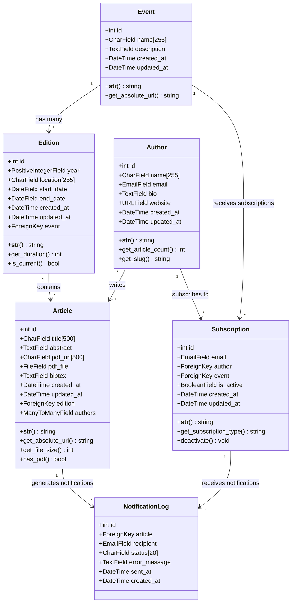
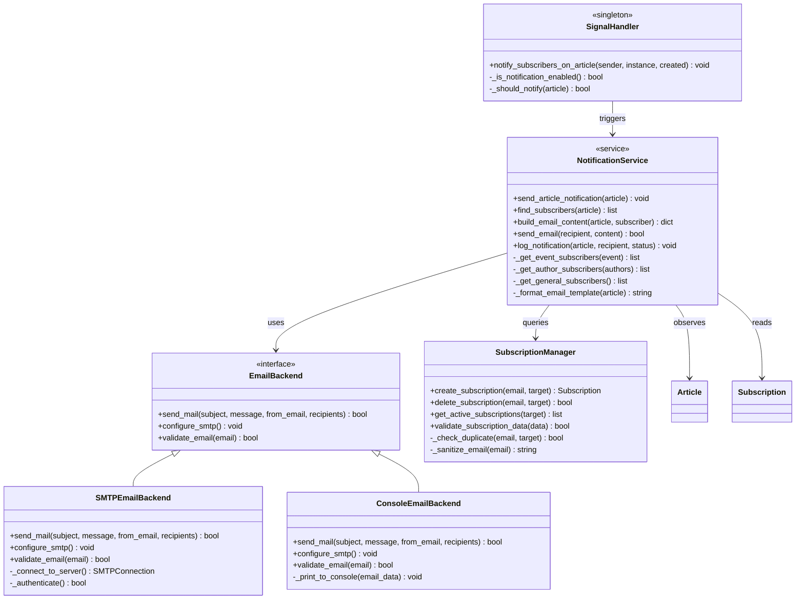
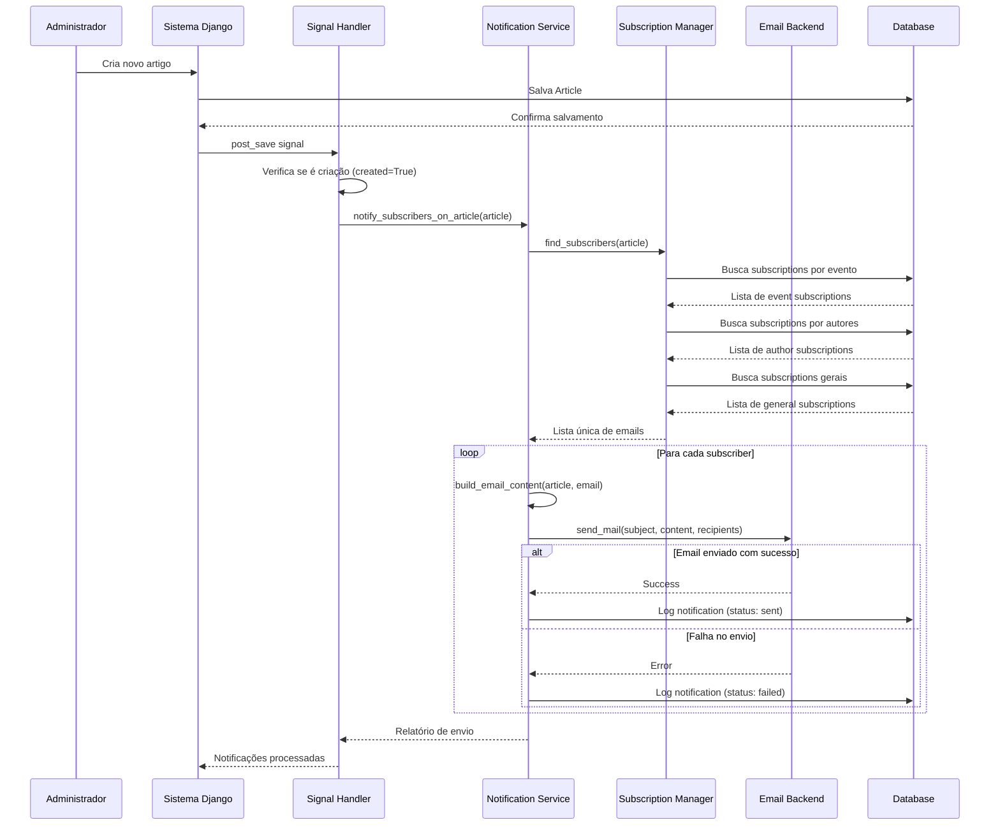
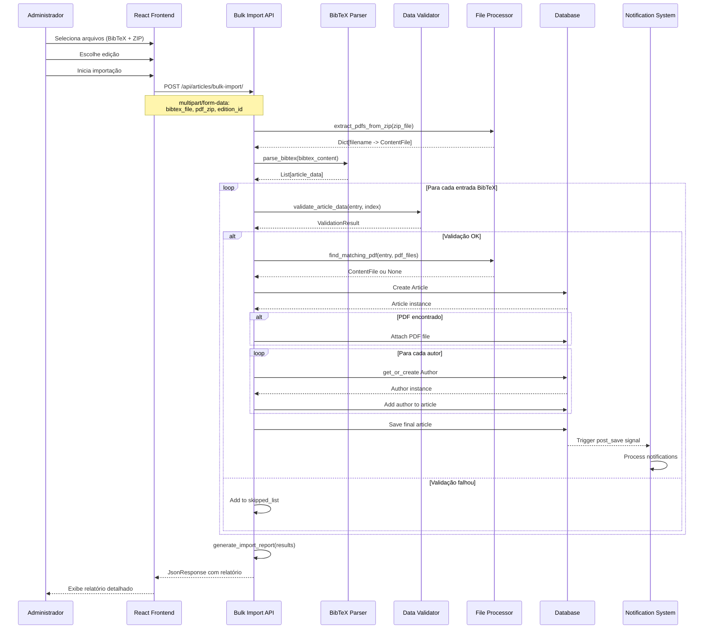
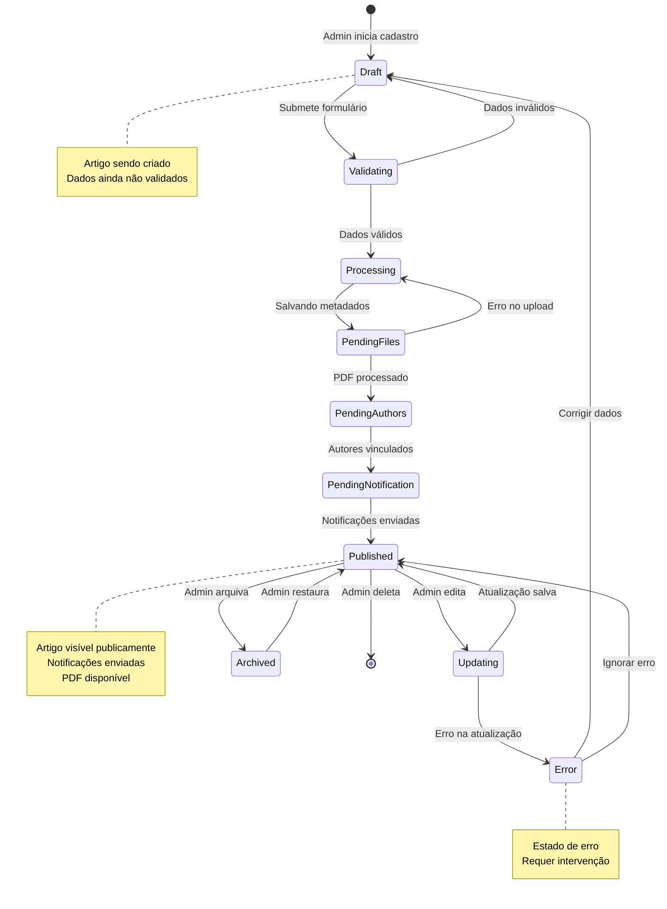

# Diagramas UML - Sistema de Biblioteca Digital

## Diagrama de Classes - Modelo de Domínio Completo

## Diagrama de Classes - Sistema de Notificações

## Diagrama de Sequência - Sistema de Notificações

## Diagrama de Sequência - Importação Bulk com Validação

## Diagrama de Estados - Ciclo de Vida do Artigo

